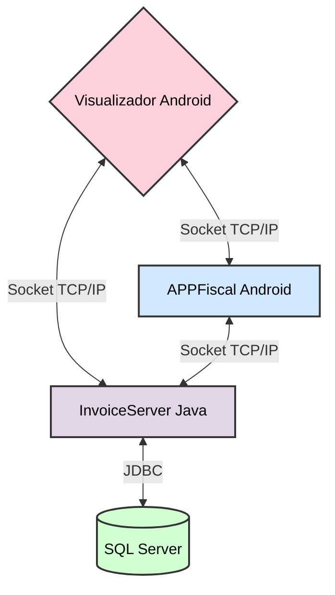

# Olá, eu sou o Giovanni Stefani 👋

Desenvolvedor com foco em **Java**, **Android** e arquitetura de sistemas para o mundo real.  
Foco em levar operações analógicas para o digital — do chão de fábrica até ecossistemas distribuídos de PDV com emissão fiscal (**NF-e / NFC-e**).

---

## 🚀 Sobre mim

- 💡 **Problemas reais:** comecei na prática criando um sistema sob medida para organizar estoque, caixa e produção de uma empresa familiar.
- 🏗️ **Arquitetura de ponta a ponta:** PDVs Android conversando com retaguarda Java via **Sockets TCP/IP**, banco corporativo e regras de negócio reais.
- 🧾 **Domínio fiscal e regulatório:** experiência prática com SEFAZ, contingência, certificados digitais (**A1/A3**), emissão de **NF-e** e **NFC-e** com a biblioteca **Java_NFe** (Samuel Oliveira).
- 📱 **Produto em produção:** sistema usado de verdade no dia a dia do negócio (não apenas protótipo).
- 🏛️ **Fundamentos sólidos:** mais de uma década de contato com tecnologia, com base em Java, Android e banco de dados corporativo.

---

## 🛠️ Stack e tecnologias

### Foco principal (atuação ativa)

### Bagagem técnica e fundamentos

### Ferramentas

**Temas de domínio:** Sockets TCP/IP · PDV · Estoque · **NF-e / NFC-e** · **Certificado digital (A1/A3)** · SEFAZ · **Java_NFe (Samuel Oliveira)** · PIX · MVVM · Integração app ↔ servidor · JasperReports · PlugPag (PagSeguro)

---

## 🧩 Ecossistema desenvolvido

Ecossistema distribuído de automação comercial e fiscal, projetado para operar com resiliência:

| Projeto | Descrição | Destaques técnicos |
| :--- | :--- | :--- |
| **[InvoiceServer](https://github.com/GiovanniStefani/InvoiceServer)** | Servidor de mensageria fiscal, retaguarda e integração externa | Java, Maven, SQL Server, **Java_NFe (Samuel Oliveira)**, Certificados A1/A3, SEFAZ, JasperReports |
| **[APPFiscal](https://github.com/GiovanniStefani/APPFiscal)** | PDV Android (v**2.1.0**) — venda, notas, PIX e catálogo | `com.github.giovannistefani.appfiscal`, Sockets, MVVM parcial, consulta/gestão de notas no app, targetSdk 36 |
| **[Visualizador](https://github.com/GiovanniStefani/Visualizador)** | Terminal do cliente — espelho da venda em tempo real | `com.github.giovannistefani.visualizador`, MVVM (`VendaViewModel`), PIX, BootReceiver |
| **[FluxoEstoque](https://github.com/GiovanniStefani/FluxoEstoque)** | Estoque, produção, caixa e pedidos (uso real **2015–2018**) | Android, Java, SQL Server, QR Code / ZXing, PIX (evoluções posteriores) |

**Packages atuais**

| App | Package |
| :--- | :--- |
| APPFiscal | `com.github.giovannistefani.appfiscal` |
| Visualizador | `com.github.giovannistefani.visualizador` |
| InvoiceServer | `com.github.giovannistefani.invoiceserver` |
| FluxoEstoque | `com.github.giovannistefani.fluxoestoque` |

---

## 📈 Linha do tempo (resumo)

| Período | Marco |
| :--- | :--- |
| **2014** | Ideia + primeiros estudos de Android e protótipo em C++ |
| **2015–2018** | **FluxoEstoque** em produção (estoque, caixa, pedidos, QR Code) |
| **Jun/2018** | Fim do uso operacional do **FluxoEstoque** |
| **Jul–Dez/2018** | Demanda fiscal (NF-e e NFC-e) → nascem **APPFiscal** e **InvoiceServer**; primeiras NFC-e |
| **2019** | NF-e em operação; servidor intermedia o acesso ao banco para o app |
| **2020–2022** | Expansão fiscal (EPEC, e-mail, eventos); início do **Visualizador** (\~2022) |
| **2023–2024** | PIX, multi-conexão no servidor, refinamentos nos apps |
| **2025–2026** | Modernização contínua: **APPFiscal 2.1.0** (package oficial, MVVM parcial), **Visualizador** com MVVM/PIX, **InvoiceServer 3.1.1** |

> Em desenvolvimento ativo até hoje: APPFiscal, InvoiceServer e Visualizador.
---

## 📌 Destaques

- Sistema usado de verdade no negócio (**FluxoEstoque**: set/2015–jun/2018)
- Ecossistema fiscal e PDV ainda em evolução (**APPFiscal**, **InvoiceServer**, **Visualizador**)
- Evolução documentada com **CHANGELOG** e versionamento semântico
- Código construído ao longo de mais de **10 anos**: do leitor de código de barras ao PDV + NF-e/NFC-e
- Comunicação via **Socket TCP**; emissão fiscal no servidor.
- Emissão de NF-e / NFC-e e integração SEFAZ com Java_NFe (certificado digital A1/A3) 
- **Visualizador** como terminal do cliente (espelhamento da venda + PIX)
---

## 📫 Conecte-se comigo

